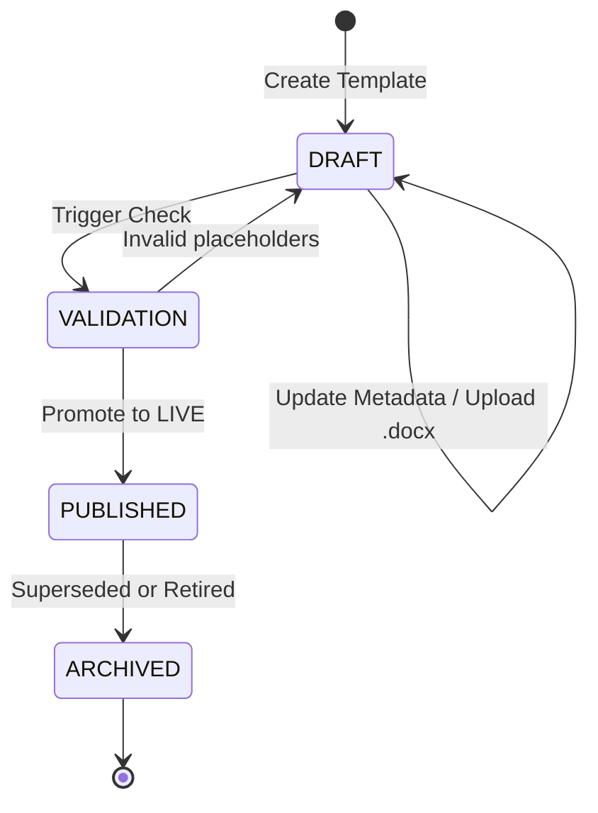
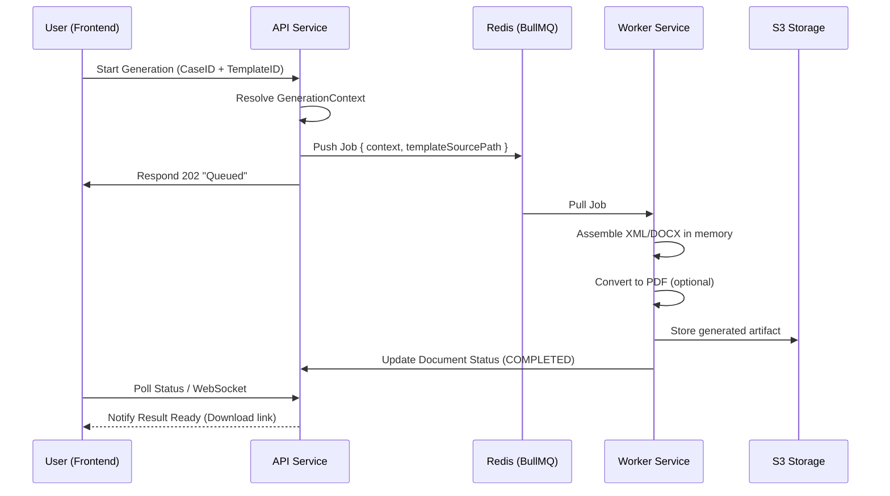

# System Architecture - Cassatix

Cassatix is designed as a distributed, service-oriented legal automation platform. This document outlines the core modules, lifecycles, and logic that drive the system.

---

## 🏗 System Components

The architecture consists of three primary application services and four infrastructure dependencies.

### Application Services
1.  **Web SPA (`apps/web`)**: A React 19 / Vite single-page application. It interacts exclusively with the API service.
2.  **API Service (`apps/api`)**: A NestJS backend that serves as the entry point for metadata, orchestration, and security. It manages the PostgreSQL state and dispatches generation jobs to Redis.
3.  **Worker Service (`apps/worker`)**: A headless Node.js process that consumes generation jobs from BullMQ. It performs heavy lifting: `.docx` assembly, `.pdf` conversion (via LibreOffice), and S3 artifact persistence.

### Infrastructure Dependencies
-   **PostgreSQL**: The relational source of truth for templates, versions, users, and document metadata.
-   **Redis / BullMQ**: Used for asynchronous job orchestration. The API pushes "generation requests" to Redis, and Workers claim them.
-   **S3 Storage (MinIO/AWS S3)**: Hosts binary assets including template source files and generated legal results.
-   **Gemini AI**: Used by both the API (for extraction) and potentially future summarization tasks.

---

## 🔄 Lifecycle: Template Management

Templates follow a strict linear progression to ensure that production documents are never generated from unstable drafts.

-   **Safety Guarantee**: The "Published" version of a template is immutable. If a lawyer needs to change a template, they must create a new version, preserving the audit trail of the original.

---

## ⚙️ Lifecycle: Document Generation

The generation process is designed to be non-blocking and resilient.

---

## 🔒 Role-Based Access Model

The system simulates a law firm hierarchy through its RBAC model.

| Role | Scope | Key Capability |
| :--- | :--- | :--- |
| **Admin** | System-wide | Can archive any template and view full audit logs. |
| **Lawyer** | Template/Content | Responsible for uploading `.docx` sources and defining variables. |
| **Partner** | Client/Case | Focuses on high-quality generation for active legal matters. |

---

## 📁 Product Logic: Case-Centric Data

Cassatix is built on the principle that **content is driven by context**. Every generation event is linked to a "Case."

### Direct Sourcing vs. AI Extraction
-   **Project 2.0 Integration**: In a production environment, the `CasesService` connects to the firm's central ERP/CMS. Currently, this is a simulated interface providing mock litigation and corporate data.
-   **Extraction Context**: When AI is used, it non-destructively maps unstructured text into the canonical `GenerationContext` schema, allowing it to "flow" into the same template engine as structured case data.

---

## 🚨 Error & Failure Handling

-   **Isolation**: If the Worker service crashes during PDF conversion, the API remains functional.
-   **Retries**: BullMQ is configured to retry failed generation jobs (e.g., if S3 is momentarily unreachable).
-   **Soft Failures**: If a template variable is missing in the data source, the system defaults to a `[N/A]` marker in the document rather than crashing the assembly thread, allowing for manual correction in the final Word doc.

---

## 🚧 Current Limitations & Roadmap

1.  **Mock Auth**: The identity layer is currently a header-based simulation (`x-user-id`).
2.  **Shared DB**: Currently, all firms share the same schema. Multitenancy via `firmId` row-level filtering is planned.
3.  **Native Editor**: Moving away from local `.docx` uploads toward a browser-based collaborative drafting environment.
