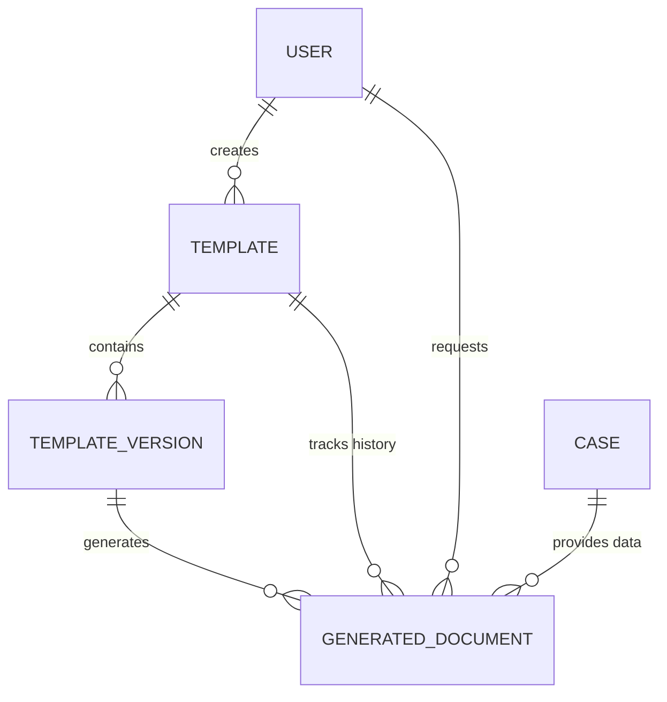

# Data Model - Cassatix

Cassatix uses a relational data model managed via Prisma ORM to track legal instruments, their versions, and the history of generated documents.

---

## 🗺 Core Entities

### 1. Template
The high-level definition of a legal document (e.g., "Master Service Agreement").
- **Fields**: `name`, `code`, `category`, `caseType`.
- **Relationship**: Owns many `TemplateVersions`. Has a pointer to one `publishedVersion`.

### 2. TemplateVersion
Represent a specific iteration of a template's content.
- **Fields**: `versionNumber`, `status` (DRAFT, PUBLISHED, ARCHIVED), `storagePath` (S3).
- **Metadata**: Includes `variablesSchemaJson` derived from the template contents.
- **Status Gate**: Only a version in `PUBLISHED` status can be used for final document production.

### 3. GeneratedDocument
The record of a specific generation event.
- **Fields**: `status` (QUEUED, PROCESSING, COMPLETED, FAILED), `generationType` (PREVIEW, FINAL), `outputFormat` (DOCX, PDF).
- **Context**: Links a `TemplateVersion` to a specific `caseId` at a point in time.

### 4. AuditLog
System-wide activity tracking.
- **Fields**: `entityType`, `action` (CREATE, UPDATE, GENERATE), `actorId`.

---

## 📊 Entity Relationship Diagram

---

## 💼 Domain Boundaries

-   **Internal Domain**: Cassatix owns all metadata regarding template lifecycle, versioning, and the logs of when/how documents were generated.
-   **External Domain (Cases)**: Case data (Parties, Dates, Effective amounts) is considered "Borrowed Context". Cassatix pulls this data via an adapter but does not own the master record of the legal matter.

---

## 🔗 Related Documentation
- [Architecture Overview](./architecture.md)
- [API Overview](./api-overview.md)
- [Back to README](../README.md)
